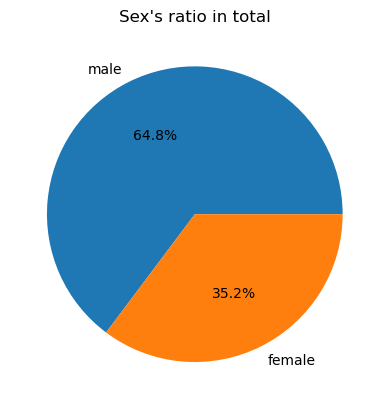
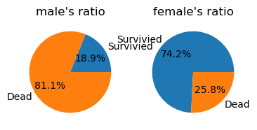
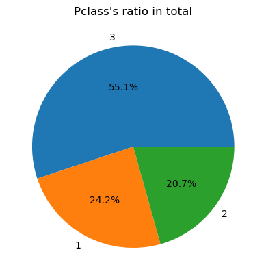
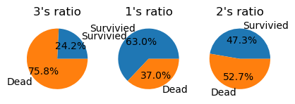
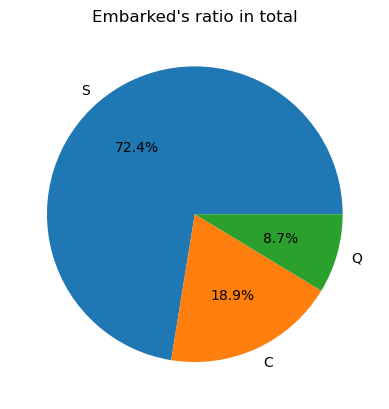
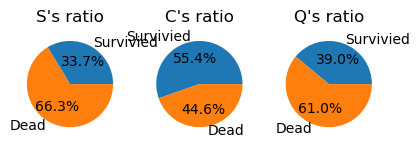
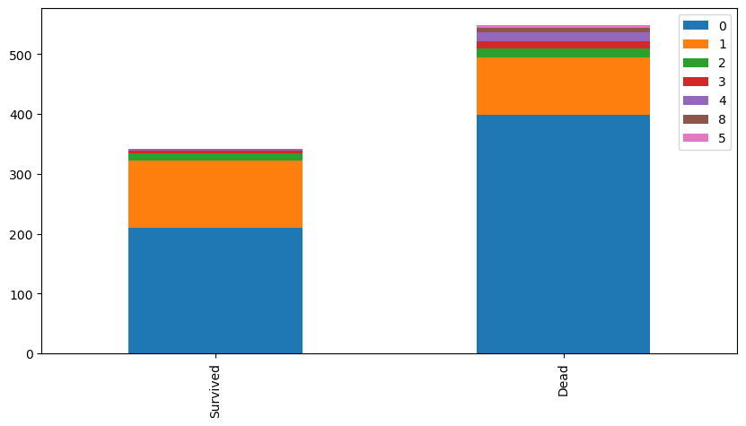
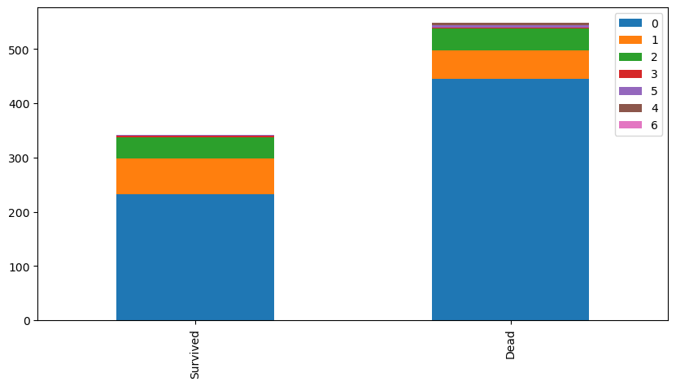
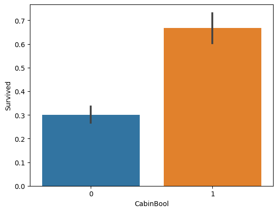

# 타이타닉 승객 정보 확인


```python
import pandas as pd
import numpy as np

train = pd.read_csv('train.csv')
test = pd.read_csv('test.csv')
```


```python
train.head()
```


<div>
<style scoped>
    .dataframe tbody tr th:only-of-type {
        vertical-align: middle;
    }

    .dataframe tbody tr th {
        vertical-align: top;
    }

    .dataframe thead th {
        text-align: right;
    }
</style>
<table border="1" class="dataframe">
  <thead>
    <tr style="text-align: right;">
      <th></th>
      <th>PassengerId</th>
      <th>Survived</th>
      <th>Pclass</th>
      <th>Name</th>
      <th>Sex</th>
      <th>Age</th>
      <th>SibSp</th>
      <th>Parch</th>
      <th>Ticket</th>
      <th>Fare</th>
      <th>Cabin</th>
      <th>Embarked</th>
    </tr>
  </thead>
  <tbody>
    <tr>
      <th>0</th>
      <td>1</td>
      <td>0</td>
      <td>3</td>
      <td>Braund, Mr. Owen Harris</td>
      <td>male</td>
      <td>22.0</td>
      <td>1</td>
      <td>0</td>
      <td>A/5 21171</td>
      <td>7.2500</td>
      <td>NaN</td>
      <td>S</td>
    </tr>
    <tr>
      <th>1</th>
      <td>2</td>
      <td>1</td>
      <td>1</td>
      <td>Cumings, Mrs. John Bradley (Florence Briggs Th...</td>
      <td>female</td>
      <td>38.0</td>
      <td>1</td>
      <td>0</td>
      <td>PC 17599</td>
      <td>71.2833</td>
      <td>C85</td>
      <td>C</td>
    </tr>
    <tr>
      <th>2</th>
      <td>3</td>
      <td>1</td>
      <td>3</td>
      <td>Heikkinen, Miss. Laina</td>
      <td>female</td>
      <td>26.0</td>
      <td>0</td>
      <td>0</td>
      <td>STON/O2. 3101282</td>
      <td>7.9250</td>
      <td>NaN</td>
      <td>S</td>
    </tr>
    <tr>
      <th>3</th>
      <td>4</td>
      <td>1</td>
      <td>1</td>
      <td>Futrelle, Mrs. Jacques Heath (Lily May Peel)</td>
      <td>female</td>
      <td>35.0</td>
      <td>1</td>
      <td>0</td>
      <td>113803</td>
      <td>53.1000</td>
      <td>C123</td>
      <td>S</td>
    </tr>
    <tr>
      <th>4</th>
      <td>5</td>
      <td>0</td>
      <td>3</td>
      <td>Allen, Mr. William Henry</td>
      <td>male</td>
      <td>35.0</td>
      <td>0</td>
      <td>0</td>
      <td>373450</td>
      <td>8.0500</td>
      <td>NaN</td>
      <td>S</td>
    </tr>
  </tbody>
</table>
</div>


```python
print('train data shape: ', train.shape)
print('test data shape: ', test.shape)
print('----------[train infomation]----------')
print(train.info())
print('----------[test infomation]----------')
print(test.info())
```

    train data shape:  (891, 12)
    test data shape:  (418, 11)
    ----------[train infomation]----------
    <class 'pandas.core.frame.DataFrame'>
    RangeIndex: 891 entries, 0 to 890
    Data columns (total 12 columns):
     #   Column       Non-Null Count  Dtype  
    ---  ------       --------------  -----  
     0   PassengerId  891 non-null    int64  
     1   Survived     891 non-null    int64  
     2   Pclass       891 non-null    int64  
     3   Name         891 non-null    object 
     4   Sex          891 non-null    object 
     5   Age          714 non-null    float64
     6   SibSp        891 non-null    int64  
     7   Parch        891 non-null    int64  
     8   Ticket       891 non-null    object 
     9   Fare         891 non-null    float64
     10  Cabin        204 non-null    object 
     11  Embarked     889 non-null    object 
    dtypes: float64(2), int64(5), object(5)
    memory usage: 83.7+ KB
    None
    ----------[test infomation]----------
    <class 'pandas.core.frame.DataFrame'>
    RangeIndex: 418 entries, 0 to 417
    Data columns (total 11 columns):
     #   Column       Non-Null Count  Dtype  
    ---  ------       --------------  -----  
     0   PassengerId  418 non-null    int64  
     1   Pclass       418 non-null    int64  
     2   Name         418 non-null    object 
     3   Sex          418 non-null    object 
     4   Age          332 non-null    float64
     5   SibSp        418 non-null    int64  
     6   Parch        418 non-null    int64  
     7   Ticket       418 non-null    object 
     8   Fare         417 non-null    float64
     9   Cabin        91 non-null     object 
     10  Embarked     418 non-null    object 
    dtypes: float64(2), int64(4), object(5)
    memory usage: 36.0+ KB
    None
    


```python
import matplotlib.pyplot as plt
%matplotlib inline
# import seaborn as sns
# sns.set() # setting seaborn default for plots
```


```python
def pie_chart(feature):
    feature_ratio = train[feature].value_counts(sort=False)
    feature_size = feature_ratio.size
    feature_index = feature_ratio.index
    survived = train[train['Survived'] == 1][feature].value_counts()
    dead = train[train['Survived'] == 0][feature].value_counts()
    

    plt.plot(aspect='auto')
    plt.pie(feature_ratio, labels=feature_index, autopct='%1.1f%%')
    plt.title(feature + '\'s ratio in total')
    plt.show()

    for i, index in enumerate(feature_index):
        plt.subplot(1, feature_size + 1, i + 1, aspect='equal')
        plt.pie([survived[index], dead[index]], labels=['Survivied', 'Dead'], autopct='%1.1f%%')
        plt.title(str(index) + '\'s ratio')

    plt.show()
```


```python
pie_chart('Sex')
```


    

    


    

    


```python
pie_chart('Pclass')
```


    

    


    

    


```python
pie_chart('Embarked')
```


    

    


    

    


### 기본적으로 여자가 더많이 살아남았으며 더 높은 클래스의 티켓을 산 승객이 살아남았고
### 출발지에서는 다른 출발지보다 Cherbourg에서 출발한 사람의 생존률이 상대적으로 높았다.


```python
def bar_chart(feature):
    survived = train[train['Survived']==1][feature].value_counts()
    dead = train[train['Survived']==0][feature].value_counts()
    df = pd.DataFrame([survived,dead])
    df.index = ['Survived','Dead']
    df.plot(kind='bar',stacked=True, figsize=(10,5))
```


```python
bar_chart("SibSp")
```


    

    


```python
bar_chart("Parch")
```


    

    


### 2명 이상의 형제나 배우자
### 2명 이상의 부모나 자식이 함께 배애탔다면
### 생존률이 올라간 것을 볼 수 있다.

### 다음은 훈련셋과 테스트셋을 합쳐서 필요한 특성들을 추가하고 전처리하는 과정을 넣는다.


```python
train_and_test = [train, test]
```


```python
for dataset in train_and_test:
    dataset['Title'] = dataset.Name.str.extract(' ([A-Za-z]+)\.')

train.head(5)
```


<div>
<style scoped>
    .dataframe tbody tr th:only-of-type {
        vertical-align: middle;
    }

    .dataframe tbody tr th {
        vertical-align: top;
    }

    .dataframe thead th {
        text-align: right;
    }
</style>
<table border="1" class="dataframe">
  <thead>
    <tr style="text-align: right;">
      <th></th>
      <th>PassengerId</th>
      <th>Survived</th>
      <th>Pclass</th>
      <th>Name</th>
      <th>Sex</th>
      <th>Age</th>
      <th>SibSp</th>
      <th>Parch</th>
      <th>Ticket</th>
      <th>Fare</th>
      <th>Cabin</th>
      <th>Embarked</th>
      <th>Title</th>
    </tr>
  </thead>
  <tbody>
    <tr>
      <th>0</th>
      <td>1</td>
      <td>0</td>
      <td>3</td>
      <td>Braund, Mr. Owen Harris</td>
      <td>male</td>
      <td>22.0</td>
      <td>1</td>
      <td>0</td>
      <td>A/5 21171</td>
      <td>7.2500</td>
      <td>NaN</td>
      <td>S</td>
      <td>Mr</td>
    </tr>
    <tr>
      <th>1</th>
      <td>2</td>
      <td>1</td>
      <td>1</td>
      <td>Cumings, Mrs. John Bradley (Florence Briggs Th...</td>
      <td>female</td>
      <td>38.0</td>
      <td>1</td>
      <td>0</td>
      <td>PC 17599</td>
      <td>71.2833</td>
      <td>C85</td>
      <td>C</td>
      <td>Mrs</td>
    </tr>
    <tr>
      <th>2</th>
      <td>3</td>
      <td>1</td>
      <td>3</td>
      <td>Heikkinen, Miss. Laina</td>
      <td>female</td>
      <td>26.0</td>
      <td>0</td>
      <td>0</td>
      <td>STON/O2. 3101282</td>
      <td>7.9250</td>
      <td>NaN</td>
      <td>S</td>
      <td>Miss</td>
    </tr>
    <tr>
      <th>3</th>
      <td>4</td>
      <td>1</td>
      <td>1</td>
      <td>Futrelle, Mrs. Jacques Heath (Lily May Peel)</td>
      <td>female</td>
      <td>35.0</td>
      <td>1</td>
      <td>0</td>
      <td>113803</td>
      <td>53.1000</td>
      <td>C123</td>
      <td>S</td>
      <td>Mrs</td>
    </tr>
    <tr>
      <th>4</th>
      <td>5</td>
      <td>0</td>
      <td>3</td>
      <td>Allen, Mr. William Henry</td>
      <td>male</td>
      <td>35.0</td>
      <td>0</td>
      <td>0</td>
      <td>373450</td>
      <td>8.0500</td>
      <td>NaN</td>
      <td>S</td>
      <td>Mr</td>
    </tr>
  </tbody>
</table>
</div>


```python
for dataset in train_and_test:
    dataset['Title'] = dataset['Title'].replace(['Capt', 'Col', 'Countess', 'Don','Dona', 'Dr', 'Jonkheer',
                                                 'Lady','Major', 'Rev', 'Sir'], 'Other')
    dataset['Title'] = dataset['Title'].replace('Mlle', 'Miss')
    dataset['Title'] = dataset['Title'].replace('Mme', 'Mrs')
    dataset['Title'] = dataset['Title'].replace('Ms', 'Miss')

train[['Title', 'Survived']].groupby(['Title'], as_index=False).mean()
```


<div>
<style scoped>
    .dataframe tbody tr th:only-of-type {
        vertical-align: middle;
    }

    .dataframe tbody tr th {
        vertical-align: top;
    }

    .dataframe thead th {
        text-align: right;
    }
</style>
<table border="1" class="dataframe">
  <thead>
    <tr style="text-align: right;">
      <th></th>
      <th>Title</th>
      <th>Survived</th>
    </tr>
  </thead>
  <tbody>
    <tr>
      <th>0</th>
      <td>Master</td>
      <td>0.575000</td>
    </tr>
    <tr>
      <th>1</th>
      <td>Miss</td>
      <td>0.702703</td>
    </tr>
    <tr>
      <th>2</th>
      <td>Mr</td>
      <td>0.156673</td>
    </tr>
    <tr>
      <th>3</th>
      <td>Mrs</td>
      <td>0.793651</td>
    </tr>
    <tr>
      <th>4</th>
      <td>Other</td>
      <td>0.347826</td>
    </tr>
  </tbody>
</table>
</div>


### 추출한 Title 데이터를 학습하기 알맞게 String Data로 변형해준다.


```python
for dataset in train_and_test:
    dataset['Title'] = dataset['Title'].astype(str)
```

### 성별도 변경해준다.


```python
for dataset in train_and_test:
    dataset['Sex'] = dataset['Sex'].astype(str)
```

### Embarked 에는 결측치가 존재한다. 아래는 이를 처리하는 과정을 나타낸다.

### 값들 중 S가 가장 많았으므로 최빈값인 S를 결측값으로 대체해준다.


```python
for dataset in train_and_test:
    dataset['Embarked'] = dataset['Embarked'].fillna('S')
    dataset['Embarked'] = dataset['Embarked'].astype(str)
```

### 나이의 결측값은 중앙값으로 처리해준다. 나이는 이상치가 있을 가능성이 크기 때문에 상대적으로 덜 영향받는 중앙값을 써준다.


```python
for dataset in train_and_test:
    dataset['Age'].fillna(dataset['Age'].median(), inplace=True)
    dataset['Age'] = dataset['Age'].astype(int)
    train['AgeBand'] = pd.cut(train['Age'], 5)
print (train[['AgeBand', 'Survived']].groupby(['AgeBand'], as_index=False).mean()) # Survivied ratio about Age Band
```

             AgeBand  Survived
    0  (-0.08, 16.0]  0.550000
    1   (16.0, 32.0]  0.344762
    2   (32.0, 48.0]  0.403226
    3   (48.0, 64.0]  0.434783
    4   (64.0, 80.0]  0.090909
    

### 숫자형 데이터는 크기의 중요도를 판단할 수 있으므로 이를 방지하기 위해 str형으로 바꿔준다.


```python
for dataset in train_and_test:
    dataset.loc[ dataset['Age'] <= 16, 'Age'] = 0
    dataset.loc[(dataset['Age'] > 16) & (dataset['Age'] <= 32), 'Age'] = 1
    dataset.loc[(dataset['Age'] > 32) & (dataset['Age'] <= 48), 'Age'] = 2
    dataset.loc[(dataset['Age'] > 48) & (dataset['Age'] <= 64), 'Age'] = 3
    dataset.loc[ dataset['Age'] > 64, 'Age'] = 4
    dataset['Age'] = dataset['Age'].map( { 0: 'Child',  1: 'Young', 2: 'Middle', 3: 'Prime', 4: 'Old'} ).astype(str)
```

### Fare의 특성은 Pclass와 연관이 있어보이므로 해당 결측치에 Pclass에 대한 Fare의 평균을 넣어준다.


```python
print (train[['Pclass', 'Fare']].groupby(['Pclass'], as_index=False).mean())
print("")
print(test[test["Fare"].isnull()]["Pclass"])
```

       Pclass       Fare
    0       1  84.154687
    1       2  20.662183
    2       3  13.675550
    
    152    3
    Name: Pclass, dtype: int64
    


```python
for dataset in train_and_test:
    dataset['Fare'] = dataset['Fare'].fillna(13.675) # The only one empty fare data's pclass is 3.
```

### 그래프가 한쪽으로 치우쳐져 있으므로 로그도 취해준다.


```python
for dataset in train_and_test:
    dataset['Fare'] = dataset['Fare'].map(lambda i: np.log(i) if i > 0 else 0)
```

### 아래는 int 형으로 해주었는데 실제로 Fare의 크기에 따라 어느정도 생존확률이 올라가므로 숫자의 크기로 판단하여도 상관없다는 의미에서 사용하였다.


```python
for dataset in train_and_test:
    dataset.loc[ dataset['Fare'] <= 7.854, 'Fare'] = 0
    dataset.loc[(dataset['Fare'] > 7.854) & (dataset['Fare'] <= 10.5), 'Fare'] = 1
    dataset.loc[(dataset['Fare'] > 10.5) & (dataset['Fare'] <= 21.679), 'Fare']   = 2
    dataset.loc[(dataset['Fare'] > 21.679) & (dataset['Fare'] <= 39.688), 'Fare']   = 3
    dataset.loc[ dataset['Fare'] > 39.688, 'Fare'] = 4
    dataset['Fare'] = dataset['Fare'].astype(float)
```

### 가족이 나눠져 있는 것은 혼란이 생길 수 있으니 두개의 특성을 하나로 합친다. 합치기전의 특성들은 삭제한다.


```python
for dataset in train_and_test:
    dataset["Family"] = dataset["Parch"] + dataset["SibSp"]
    dataset['Family'] = dataset['Family'].astype(int)
```


```python
for dataset in train_and_test:
    dataset['Family'] = dataset['Family'].map(lambda i: np.log(i) if i > 0 else 0)
```

### cabin 또한 사용할 수 있을 것처럼 보인다.
### 자신의 방이 있다면 앞서 말한 지위가 높을 가능성이 있고 지위가 높다면 생존률이 높기 때문이다.


```python
import seaborn as sns

for dataset in train_and_test:
    dataset["CabinBool"] = (dataset["Cabin"].notnull().astype('int'))


#calculate percentages of CabinBool vs. survived
print("Percentage of CabinBool = 1 who survived:", train["Survived"][train["CabinBool"] == 1].value_counts(normalize = True)[1]*100)

print("Percentage of CabinBool = 0 who survived:", train["Survived"][train["CabinBool"] == 0].value_counts(normalize = True)[1]*100)
#draw a bar plot of CabinBool vs. survival
sns.barplot(x="CabinBool", y="Survived", data=train)
plt.show()
```

    Percentage of CabinBool = 1 who survived: 66.66666666666666
    Percentage of CabinBool = 0 who survived: 29.985443959243085
    


    

    


### 실제로 방이 있는 사람의 생존율이 더 높았다.


### 이제 필요없는 특성들을 제거한다.
### ticket은 유용한 데이터를 뽑기 힘드므로 제거한다.


```python
features_drop = ['Name', 'SibSp', 'Parch','Cabin','Ticket']
train = train.drop(features_drop, axis=1)
test = test.drop(features_drop, axis=1)
train = train.drop(['PassengerId', 'AgeBand'], axis=1)

print(train.head())
print(test.head())
```

       Survived  Pclass     Sex     Age  Fare Embarked Title  Family  CabinBool
    0         0       3    male   Young   0.0        S    Mr     0.0          0
    1         1       1  female  Middle   0.0        C   Mrs     0.0          1
    2         1       3  female   Young   0.0        S  Miss     0.0          0
    3         1       1  female  Middle   0.0        S   Mrs     0.0          1
    4         0       3    male  Middle   0.0        S    Mr     0.0          0
       PassengerId  Pclass     Sex     Age  Fare Embarked Title    Family  \
    0          892       3    male  Middle   0.0        Q    Mr  0.000000   
    1          893       3  female  Middle   0.0        S   Mrs  0.000000   
    2          894       2    male   Prime   0.0        Q    Mr  0.000000   
    3          895       3    male   Young   0.0        S    Mr  0.000000   
    4          896       3  female   Young   0.0        S   Mrs  0.693147   
    
       CabinBool  
    0          0  
    1          0  
    2          0  
    3          0  
    4          0  
    

### 이제 분리해준다.


```python
# One-hot-encoding for categorical variables
train = pd.get_dummies(train)
test = pd.get_dummies(test)

train_label = train['Survived']
train_data = train.drop('Survived', axis=1)
test_data = test.drop("PassengerId", axis=1).copy()
```


```python
from sklearn.linear_model import LogisticRegression
from sklearn.svm import SVC
from sklearn.neighbors import KNeighborsClassifier
from sklearn.ensemble import RandomForestClassifier
from sklearn.naive_bayes import GaussianNB

from sklearn.utils import shuffle
```


```python
train_data, train_label = shuffle(train_data, train_label, random_state = 5)
```


```python
def train_and_test(model):
    model.fit(train_data, train_label)
    prediction = model.predict(test_data)
    accuracy = round(model.score(train_data, train_label) * 100, 2)
    print("Accuracy : ", accuracy, "%")
    return prediction
```


```python
# Logistic Regression
log_pred = train_and_test(LogisticRegression())
# SVM
svm_pred = train_and_test(SVC())
#kNN
knn_pred_4 = train_and_test(KNeighborsClassifier(n_neighbors = 4))
# Random Forest
rf_pred = train_and_test(RandomForestClassifier(n_estimators=100))
# Navie Bayes
nb_pred = train_and_test(GaussianNB())
```

    Accuracy :  83.95 %
    Accuracy :  83.73 %
    Accuracy :  84.62 %
    Accuracy :  86.98 %
    Accuracy :  79.57 %
    


```python
submission = pd.DataFrame({
    "PassengerId": test["PassengerId"],
    "Survived": rf_pred
})

submission.to_csv('submission_rf.csv', index=False)
```


```python

```
